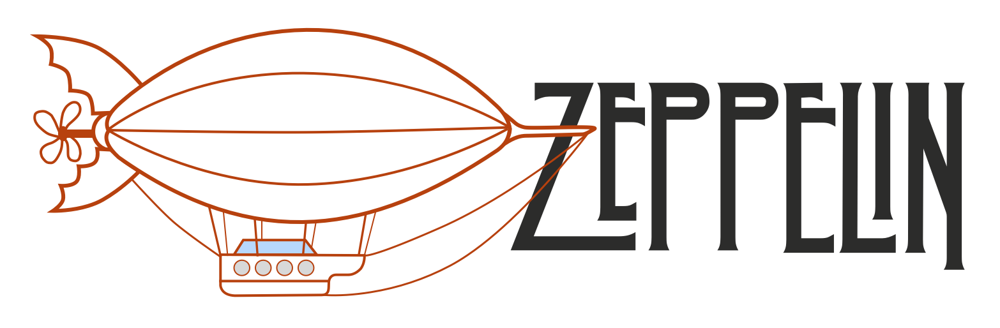

Zeppelin is a tiny web server for uploading and downloading files able to run on close to any system without dependencies and with some extra pentester toys.

## Build:

```
git clone https://github.com/hcninja/zeppelin.git
cd zeppelin
cargo build --release
```

You will find your compiled binary under `target/release/zeppelin`.

Or just download the latest release for your architecture directly from [releases](https://github.com/hcninja/zeppelin/releases/).

## Usage:
With `./zeppelin --help` you will get the available flags.

```
OPTIONS:
    -h, --host <HOST>    Host address for the file-server [127.0.0.1]
    -d, --dir <PATH>     Directory to serve [./]
    -p, --port <PORT>    Port for the file-server [8080]
```

The standard running mode, is to serve the path where `zeppelin` is running on. For serving the `/etc` directory on all interfaces on port 8443 you can use `./zeppelin -h 0.0.0.0 -p 8443 -d /etc`.


## ToDo:
- [x] Navigate the served directory
- [x] File upload
- [ ] HTTPS
- [ ] System command execution
- [ ] File navigator and uploader authentication
- [ ] Web interface for logging request with headers
- [ ] Process injection/migration
